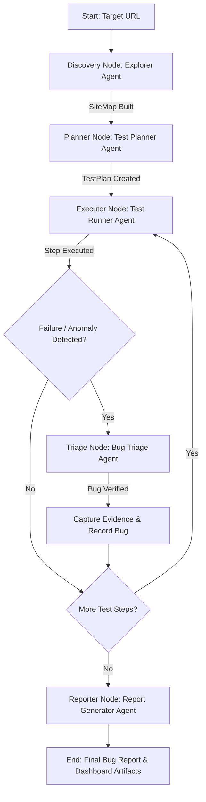

# ChaosPilot: Autonomous AI QA & Bug-Hunting Engineer
## Product Specification (SPEC.md) — DEFINE Phase

> **Phase**: DEFINE  
> **Status**: Approved Specification  
> **Version**: 1.0.0 (V1 Scope)  
> **Framework**: Addy Osmani Agent Engineering Workflow (DEFINE → PLAN → BUILD → VERIFY → REVIEW → SHIP)

---

## 1. Executive Summary & Vision

**ChaosPilot** is an autonomous AI-driven QA and Bug-Hunting Engineer designed to crawl, map, test, and detect vulnerabilities/bugs in web applications. Given a target URL, ChaosPilot acts as a high-velocity human QA tester: exploring routes, filling out forms with edge-case and boundary inputs, executing negative test scenarios, capturing console/network logs and visual evidence, and emitting clean, reproducible bug reports.

### Primary Objectives for V1
- **Autonomous Discovery**: Crawl web applications to map routes, DOM components, and interactive user flows.
- **Risk-Based Test Planning**: Generate intelligent, target-aware test suites covering functional, boundary, negative, and chaos scenarios.
- **Robust Execution Engine**: Execute browser interactions via Playwright with real-time log monitoring (console exceptions, network 4xx/5xx errors).
- **Evidence-Backed Bug Reporting**: Produce actionable reports with step-by-step reproduction scripts, DOM snapshots, network HAR logs, Playwright traces, and visual screenshots.

---

## 2. Product Critique & Challenge Analysis (Idea Validation)

Building an autonomous browser-agent for QA presents severe failure modes if not carefully constrained:

| Challenge / Failure Mode | Failure Mechanism | ChaosPilot V1 Mitigation Strategy |
| :--- | :--- | :--- |
| **Context Bloat & Token Exhaustion** | Sending full raw HTML / DOM trees into LLM prompts leads to massive token usage and latency. | **Accessibility Tree Pruning**: Extract light, semantic Accessibility Trees (AXTree) with unique reference IDs instead of raw HTML. |
| **Dynamic DOM & Hydration Volatility** | Dynamic SPAs (React/Vue/Svelte) alter selectors, element IDs, and re-render asynchronously. | **Action-by-Ref ID System**: Playwright binds dynamic elements to stable integer reference IDs per step snapshot. |
| **Destructive UI Actions** | AI agents might click "Delete Account", "Clear Database", or fire production webhooks. | **Strict Action Guardrails**: Regex-based action blacklists filter dangerous terms (`delete`, `drop`, `purge`, `reset`, `cancel-subscription`). |
| **False Positive Bug Detection** | Transient network hiccups or non-standard styling mistaken for bugs. | **Multi-Signal Assertion Engine**: Require correlated evidence (e.g. Uncaught JS Exception + HTTP 500 OR explicit test plan assertion failure). |
| **Infinite Exploration Loops** | Agent gets trapped navigating between paginated links, footers, or endless modals. | **Graph Depth & Page Caps**: Hard limit exploration to `max_depth=3` and `max_pages=25` per run, tracked via URI canonicalization. |

---

## 3. Technical Risk Matrix

| Risk ID | Risk Description | Severity | Probability | Technical Mitigation |
| :--- | :--- | :--- | :--- | :--- |
| **TR-01** | Playwright action timeouts due to slow page loads or dynamic elements | High | Medium | Explicit `wait_for_load_state("networkidle")` and fallback locator retry strategy with configurable timeout (10s). |
| **TR-02** | Authentication / Captcha blocker traps during autonomous navigation | Critical | Medium | V1 supports explicit seed auth credentials (cookie/token or basic auth config) and detects Captchas to abort route safely. |
| **TR-03** | Subdomain drift (agent follows external links like Twitter/Stripe) | High | High | Strict Domain Lock Guardrail: URL host matcher aborts any request outside the target domain. |
| **TR-04** | Form submission spam / email triggers during testing | Medium | High | Synthetic test data generator using `fake-data` rules (e.g., `@example.com` domains only, sandbox inputs). |
| **TR-05** | LLM hallucination in bug severity or reproduction steps | Medium | Medium | Rule-driven triage validator verifies log traces against step history before finalizing bug reports. |

---

## 4. V1 MVP Scope Definition

### 🎯 In-Scope (V1)
1. **Target Input**: Target Application URL, optional seed auth configuration, maximum run parameters.
2. **Application Discovery**: Autonomous exploration to build a canonical `SiteMap` (routes, pages, forms, interactive controls).
3. **Risk-Based Test Generation**: LLM-assisted test case creation prioritizing high-risk interactive flows (forms, auth, input validation, boundaries).
4. **Browser Test Execution**: Playwright-driven browser session execution (Chromium).
5. **Multi-Vector Failure Detection**:
   - Uncaught JavaScript runtime errors (`window.onerror`, unhandled promise rejections).
   - HTTP Network failures (4xx/5xx status codes, CORS failures).
   - Form boundary failures (unhandled server errors on invalid input, missing UI validations).
   - Page crashes or blank renders.
6. **Rich Evidence Capture**:
   - Annotated PNG screenshots on failure steps.
   - Network HAR archive.
   - Console log transcript.
   - Playwright `.zip` trace files.
   - Standalone Python Playwright script to reproduce the issue locally.
7. **Structured Reporting**: Markdown report + JSON schema output.
8. **Web Dashboard UI**: React + Vite + Tailwind interface to launch runs, view live step progress, inspect site maps, and download bug reports & evidence.

### 🚫 Out-of-Scope (V1)
- Source code repository parsing & root-cause code inspection (Deferred to V2).
- Automatic code patch / PR generation (Deferred to V2).
- Automated regression test suite generation in local code repos (Deferred to V2).
- Cloud multi-tenant orchestration (V1 runs locally or in Docker).

---

## 5. Agent Architecture & LangGraph Workflow

ChaosPilot utilizes **LangGraph** to model the stateful, cyclic workflow of autonomous QA testing.



### Agent Responsibilities

1. **`ExplorerAgent` (Discovery Node)**:
   - Initializes Playwright browser context.
   - Crawls target URL up to `max_depth` and `max_pages`.
   - Extracts routes, inputs, forms, buttons, links, and accessibility tree snapshots.
   - Builds canonical `SiteMap`.

2. **`TestPlannerAgent` (Planner Node)**:
   - Analyzes `SiteMap` and form specifications using Gemini 2.5.
   - Generates structured `TestPlan` categorized by test type:
     - `FUNCTIONAL`: Standard happy path user flows.
     - `NEGATIVE`: Submitting empty forms, invalid emails, malformed payloads.
     - `BOUNDARY`: Inputting long strings (10,000+ chars), special characters (`<script>`, `' OR 1=1`), numeric overflows.
     - `CHAOS`: Rapid button double-clicks, back-forward navigation mid-form submission.

3. **`TestRunnerAgent` (Executor Node)**:
   - Translates abstract test steps into low-level Playwright actions (`click`, `fill`, `select`, `press`).
   - Attaches real-time listeners to `console` events and `response` network events.
   - Evaluates step assertions after each interaction.

4. **`BugTriageAgent` (Triage Node)**:
   - Evaluates failed assertions, console stack traces, or 500 HTTP responses.
   - Filters out known noise/flaky warnings.
   - Assigns severity: `CRITICAL` (Page crash/500 error), `HIGH` (Uncaught JS exception/Data loss), `MEDIUM` (Validation failure/4xx), `LOW` (Minor visual issue).

5. **`ReportGeneratorAgent` (Reporter Node)**:
   - Synthesizes all recorded bugs and execution logs into a structured Markdown document and JSON payload.
   - Generates a standalone Python script to reproduce each bug independently.

---

## 6. Agent State Schema (LangGraph State Specification)

The state object `ChaosPilotState` persists throughout the entire execution lifecycle in SQLite:

```python
from typing import List, Dict, Optional, Any
from enum import Enum
from pydantic import BaseModel, Field

class RunStatus(str, Enum):
    IDLE = "IDLE"
    DISCOVERING = "DISCOVERING"
    PLANNING = "PLANNING"
    EXECUTING = "EXECUTING"
    TRIAGING = "TRIAGING"
    COMPLETED = "COMPLETED"
    FAILED = "FAILED"

class TestCategory(str, Enum):
    FUNCTIONAL = "FUNCTIONAL"
    NEGATIVE = "NEGATIVE"
    BOUNDARY = "BOUNDARY"
    CHAOS = "CHAOS"

class BugSeverity(str, Enum):
    CRITICAL = "CRITICAL"
    HIGH = "HIGH"
    MEDIUM = "MEDIUM"
    LOW = "LOW"

class FormElement(BaseModel):
    selector: str
    element_type: str  # text, email, password, select, checkbox, submit
    name: Optional[str] = None
    placeholder: Optional[str] = None
    is_required: bool = False

class RouteNode(BaseModel):
    url: str
    title: str
    depth: int
    forms: List[FormElement] = []
    interactive_selectors: List[str] = []

class TestStep(BaseModel):
    step_id: str
    action: str  # NAVIGATE, CLICK, FILL, CHECK, PRESS, ASSERT
    target_selector: Optional[str] = None
    value: Optional[str] = None
    expected_outcome: str

class TestCase(BaseModel):
    id: str
    title: str
    description: str
    category: TestCategory
    target_route: str
    steps: List[TestStep]

class StepResult(BaseModel):
    step_id: str
    success: bool
    screenshot_path: Optional[str] = None
    error_message: Optional[str] = None
    console_errors: List[str] = []
    network_errors: List[str] = []
    duration_ms: float

class BugReport(BaseModel):
    id: str
    title: str
    severity: BugSeverity
    route: str
    failed_step_id: str
    description: str
    reproduction_steps: List[str] = []
    console_logs: List[str] = []
    network_logs: List[str] = []
    screenshot_path: str
    trace_path: str
    reproduction_script_path: str

class ChaosPilotState(BaseModel):
    run_id: str
    target_url: str
    max_depth: int = 3
    max_pages: int = 25
    status: RunStatus = RunStatus.IDLE
    site_map: Dict[str, RouteNode] = {}
    test_plan: List[TestCase] = []
    current_test_index: int = 0
    execution_results: Dict[str, List[StepResult]] = {}
    discovered_bugs: List[BugReport] = []
    error_summary: Optional[str] = None
```

---

## 7. Agent Tool Definitions (Capabilities & Signatures)

The agents operate via strict, type-annotated tool interfaces wrapped in Pydantic:

### 1. `browser_navigate`
- **Description**: Navigates the browser to a target URL within the allowed domain.
- **Parameters**: `url: str`, `wait_until: str = "networkidle"`
- **Returns**: `{ "status_code": int, "title": str, "current_url": str, "axtree": str }`

### 2. `browser_extract_page_map`
- **Description**: Scans current viewport to identify links, forms, buttons, and inputs with assigned reference IDs.
- **Parameters**: `None`
- **Returns**: `RouteNode` (forms, selectors, accessibility tree snippet)

### 3. `browser_execute_action`
- **Description**: Performs a UI interaction on an element using Playwright.
- **Parameters**: `action: str` (`click` | `fill` | `select` | `press`), `selector_or_ref: str`, `value: Optional[str]`
- **Returns**: `StepResult` (success status, captured console errors, captured 4xx/5xx network responses)

### 4. `browser_capture_evidence`
- **Description**: Captures PNG screenshot, HAR network trace, and Playwright trace file.
- **Parameters**: `step_id: str`, `test_id: str`
- **Returns**: `{ "screenshot_path": str, "trace_path": str, "har_path": str }`

### 5. `generate_reproduction_script`
- **Description**: Compiles test steps and evidence into a runnable standalone Python Playwright script.
- **Parameters**: `bug_report_id: str`, `steps: List[TestStep]`
- **Returns**: `{ "script_path": str, "code": str }`

---

## 8. Safety & Guardrail System

To prevent unintended side-effects or security breaches during automated exploration:

```mermaid
graph LR
    ActionRequest[Agent Action Request] --> GuardrailCheck{Passes Safety Policies?}
    GuardrailCheck -->|Domain Lock: Match Target Host| Rule1[Check Target Domain]
    GuardrailCheck -->|Destructive Blacklist: Match Action Words| Rule2[Check Action Blacklist]
    GuardrailCheck -->|Sanitize PII / Synthetic Inputs| Rule3[Check Input Payload]
    Rule1 & Rule2 & Rule3 -->|All Pass| Execute[Execute via Playwright]
    Rule1 | Rule2 | Rule3 -->|Violation| Abort[Block Action & Log Guardrail Trigger]
```

### Key Safety Policies
1. **Domain Lock Policy**:
   - Matches host header against initial `target_url`.
   - Any link leading outside domain (e.g. `https://facebook.com`, `https://stripe.com`) is logged and skipped.
2. **Destructive Action Blacklist**:
   - Intercepts clicks or text submission containing regex pattern: `(?i)(delete|purge|wipe|reset-db|cancel-subscription|drop-table|destroy)`.
   - Flagged actions require explicit bypass configuration; otherwise skipped with a `GUARDRAIL_BLOCKED` note.
3. **Synthetic Input Enforcer**:
   - All email fields populated with `@example.com` or `@test-chaospilot.local`.
   - Passwords generated using random synthetic strings (`TestPass123!#`).
4. **Execution Timeout Caps**:
   - Max total run time: 15 minutes.
   - Max step execution time: 15 seconds.

---

## 9. Technology Stack Architecture

```
                  ┌──────────────────────────────────────────────┐
                  │            React + Vite + Tailwind           │
                  │             (Web Monitoring UI)              │
                  └──────────────────────┬───────────────────────┘
                                         │ REST API / WebSockets
                  ┌──────────────────────▼───────────────────────┐
                  │                 FastAPI App                  │
                  │           (Orchestrator & Service)           │
                  └──────────────────────┬───────────────────────┘
                                         │
                  ┌──────────────────────▼───────────────────────┐
                  │             LangGraph State Machine          │
                  │ (Explorer -> Planner -> Executor -> Triage) │
                  └──────┬──────────────────────┬────────────────┘
                         │                      │
       ┌─────────────────▼──────────────┐  ┌────▼────────────────────────┐
       │   Playwright Browser Engine    │  │    Google Gemini API       │
       │    (Chromium Automation)       │  │ (2.5 Flash / 2.5 Pro)      │
       └─────────────────┬──────────────┘  └────────────────────────────┘
                         │
       ┌─────────────────▼──────────────┐
       │         SQLite Database        │
       │  (Runs, State, Bugs, Evidence) │
       └────────────────────────────────┘
```

### Detailed Tech Stack Matrix
- **Backend Framework**: Python 3.13 + FastAPI + Pydantic v2
- **Agent Orchestration**: LangGraph + LangChain Core
- **LLM Engine**: Google Gemini API via `langchain-google-genai` (`gemini-2.5-flash` for high-speed exploration, `gemini-2.5-pro` for test plan synthesis & triage)
- **Browser Automation**: Playwright Python Async API (`playwright.async_api`)
- **Database & Persistence**: SQLite via `aiosqlite` and `SQLModel`
- **Frontend UI**: React 18 + Vite + Tailwind CSS + Lucide Icons + React Query
- **Testing & Tooling**: `pytest`, `pytest-asyncio`, Docker, GitHub Actions CI

---

## 10. Engineering Workflow & Phased Roadmap

Following the **Addy Osmani Agent Engineering Workflow**:

- [x] **DEFINE Phase** *(Current)*:
  - Validated requirements and challenged failure modes.
  - Defined architecture, LangGraph state machine, tool definitions, and safety rules.
  - Created `SPEC.md`.

- [ ] **PLAN Phase** *(Next Step)*:
  - Decompose specification into modular task components.
  - Design database schemas and API specifications.
  - Define folder directory structure and configuration files.
  - Create `PLAN.md`.

- [ ] **BUILD Phase**:
  - Implement Backend API & LangGraph state machine.
  - Build Playwright tool suite and safety guardrails.
  - Implement React UI dashboard for monitoring runs.

- [ ] **VERIFY Phase**:
  - Run `pytest` unit & integration test suite.
  - Benchmark ChaosPilot against real sample web apps (e.g. OWASP Juice Shop, TodoMVC, demo ecommerce sites).

- [ ] **REVIEW Phase**:
  - Code review, linting, security audit of guardrails, performance tuning.

- [ ] **SHIP Phase**:
  - Docker containerization, setup scripts, GitHub Actions workflow pipeline, release notes.

---

### Sign-off & Next Action
The **DEFINE** phase is complete. The system architecture, agent boundaries, safety systems, and tech stack for **ChaosPilot V1** are fully defined.

**Next Phase**: Transition to **PLAN** phase to create `PLAN.md` with full implementation task breakdown.
